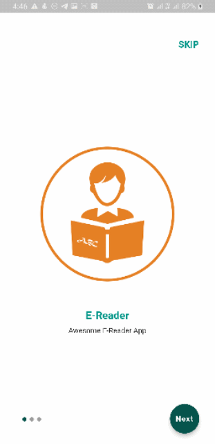

# name: e_reader_app
## description: Flutter app for both android and ios, that enable users to load epub files into the app which are automatically save to a local database.

### Offline Support Provided.
Files uploaded can be viewed later (store in a local storage).

### Services Used:
    Framework: Flutter
    Programming Language: Dart
    Datbase: Hive DB

### Features of the app:
      - Add epub file.
      - Read book (epub file).
      - Delete book.
      - Search book by title or date.
      - user onboarding screens provided.

### To use this project:
    1. Clone the project.
    2. run flutter pub get

### Flutter packages used:
    cupertino_icons: ^1.0.2
    get: ^4.6.1
    lottie: ^1.2.2
    flutter_native_splash: ^2.1.2+1
    shared_preferences: ^2.0.12
    file_picker: ^4.1.3
    path_provider: ^2.0.12
    vocsy_epub_viewer: ^1.0.1
    hive: ^2.2.1
    hive_flutter: ^1.1.0
    intl: ^0.17.0
    awesome_dialog: ^2.2.1

### You need to add your project to the following platforms:

- [Flutter](https://flutter.dev/)
- [Hive](https://github.com/hivedb/hive)